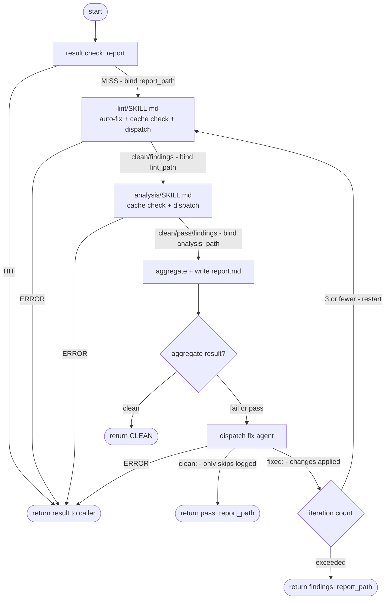

# Markdown Hygiene Specification

## Purpose

Detect markdownlint violations in a `.md` file and produce a cache record with
imperative `Fix:` instructions for each finding. The executor never modifies the
target file. A separate ad-hoc dispatch at the host orchestration layer applies
the fixes and drives an iteration loop until the file is clean or the iteration
limit is reached.

## Architecture

The skill has three distinct layers, implemented across two executor sub-skills and one host orchestration file.

### Lint Executor (`lint/instructions.txt`)

Haiku-class. Deterministic pattern-matching only. It:

- Runs the `verify.sh`/`verify.ps1` script, then scans for remaining MD violations via rule-knowledge.
- Writes `lint.md` at `<lint_path>` with `operation_kind: markdown-hygiene-lint` and `result: clean|fail`.
- Returns `clean` or `findings: <lint_path>` to its dispatch caller.
- **Never** modifies the target file. Hard prohibition on script authoring.
- This layer is unchanged by iteration logic — **always** a single detect pass.

`lint.md` feeds the host aggregate step alongside `analysis.md`. The aggregate result — not `lint.md` alone — determines whether the iteration loop fires.

### Analysis Executor

`analysis/instructions.txt` — Sonnet-class (or GPT-5.4). Semantic reasoning. It:

- Reads `<lint_path>` to extract the lint result and violation count.
- Evaluates SA001–SA038 advisory rules against the target file.
- Writes `analysis.md` at `<analysis_path>` with `operation_kind: markdown-hygiene-analysis` and `result: clean|pass|fail`.
- Returns `clean`, `pass: <analysis_path>`, or `findings: <analysis_path>` to its dispatch caller.
- **Never** modifies the target file. Hard prohibition on script authoring.

`analysis.md` feeds the host aggregate step. The host — not the analysis executor — writes `report.md`.

### Host Orchestration Layer (`SKILL.md`)

The host is the agent that reads `SKILL.md` and drives the full workflow.



Steps:

1. **Result check (report).** Cache hit → return to caller. Miss → bind `<report_path>`.
2. **Lint.** Follow `lint/SKILL.md`. Sub-skill handles auto-fix, cache check, and dispatch. Bind `<lint_path>` from return.
3. **Analysis.** Follow `analysis/SKILL.md`. Sub-skill handles cache check and dispatch. Bind `<analysis_path>` from return.
4. **Aggregate.** Derive combined result from `<lint_path>` and `<analysis_path>`. Write `report.md`.
5. **Iteration check.** Clean → return `CLEAN`. Fail/pass → dispatch fix agent.
   - `fixed:` — restart from step 2 (max 3 times; then return `findings:`).
   - `clean:` — return `pass: <report_path>`.

**Pruning is out of scope.** Do NOT run `hash-record/prune` from this skill or its sub-skills. Pruning during a seal chain destroys valid records produced by sibling skills before they can be committed. Operators run prune as a separate maintenance pass after seal commits land.

### Result Check Tool

The `result` scripts (`result.sh` / `result.ps1`) wrap `hash-record/check` and translate the HIT into a cached verdict. They accept a **mode argument** that controls which sub-file is checked and what a HIT means.

**Invocation:**

```text
bash result.sh <markdown_file_path> <mode>
pwsh result.ps1 <markdown_file_path> <mode>
```

**Modes:**

| Mode | Target file | HIT → output | MISS → output |
| ------ | ------------- | -------------- | -------------- |
| `report` | `report.md` | `CLEAN` (result: clean), `pass: <path>` (result: pass), or `findings: <path>` (result: fail) | `MISS: <abs-path>` |
| `lint` | `lint.md` | `clean: <path>` (result: clean) or `findings: <path>` (result: fail) | `MISS: <abs-path>` |
| `analysis` | `analysis.md` | `clean: <path>` (result: clean), `pass: <path>` (result: pass), or `findings: <path>` (result: fail) | `MISS: <abs-path>` |

**Rules:**

- Mode is required. Missing mode → `ERROR: missing mode argument`, exit 1.
- Unrecognized mode → `ERROR: unrecognized mode: <value>`, exit 1.
- Each mode resolves its target file as a sibling of `report.md` in the hash-record cache directory — same directory, different filename.
- `MISS` path always points to the target file for that mode (e.g. `lint` MISS path = `<cache_dir>/lint.md`).
- Each MISS path is the write target to pass to the corresponding executor.

**Path acquisition** (host):

```text
<report_path>   = MISS path from `result report`
<lint_path>     = MISS path from `result lint`; re-confirmed via second `result lint` call after lint phase
<analysis_path> = MISS path from `result analysis`
```

### Dispatch Surface

The `dispatch` skill takes a single `<prompt>` — a verbatim string sent to the sub-agent. It does NOT perform template substitution. The host composes the full prompt before calling dispatch.

**Lint phase prompt** — host-composed variables:

- `<lint-instructions-abspath>` = absolute path to `lint/instructions.txt`
- `<input-args>` = `<markdown_file_path> --lint-path <lint_path> [--ignore <RULE>[,<RULE>...]]`
- `<prompt>` = `Read and follow <lint-instructions-abspath>; Input: <input-args>`

**Analysis phase prompt** — host-composed variables:

- `<analysis-instructions-abspath>` = absolute path to `analysis/instructions.txt`
- `<input-args>` = `<markdown_file_path> --lint-path <lint_path> --analysis-path <analysis_path> [--ignore ...]`
- `<prompt>` = `Read and follow <analysis-instructions-abspath>; Input: <input-args>`

**Fix pass prompt** — host-composed variables:

- `<prompt>` = `For <markdown_file_path>: (a) read <lint_path> and fix every FAIL-severity item; (b) read <analysis_path> and for each advisory, either apply the fix or append "Skipped: <reason>" to the advisories section of <report_path>. Return \`fixed: <report_path>\` if any fixes were applied to <markdown_file_path>, or \`clean: <report_path>\` if only skipped entries were logged.`

## Scope

Any `.md` file in the workspace. Primary consumers: skill-writing flow (pre-commit hygiene pass), spec-writing, agent docs, task docs.

## Why Dispatch

Lint is mechanical — Haiku handles it cheaply. Analysis is semantic — Sonnet earns its cost. Separating them avoids paying Sonnet rates for pattern matching and reserves semantic reasoning for rules that actually need it.

## Model Tier Rationale

- **Lint executor** (`fast-cheap` / Haiku-class): deterministic rule application, no judgment needed.
- **Analysis executor** (`standard` / Sonnet-class or GPT-5.4): SA rules require understanding intent, instruction quality, and semantic consistency.
- **Fix pass** (`standard` / Sonnet-class): editing requires judgment — applying byte-precise fixes to the correct lines without introducing new violations.

## Definitions

No domain-specific terms. Rule identifiers (MD001, MD022, etc.) are markdownlint rule codes; SA001–SA038 are advisory rules defined in this spec. Their meaning is defined here, not by any external rule set.

## Requirements

### Inputs (Host Layer)

Input shape: `<markdown_file_path> [--ignore <RULE>[,<RULE>...]]`

- `<markdown_file_path>` (positional, required): Absolute path to the `.md` file
  to scan. No other positional argument exists.
- `--ignore <RULE>[,<RULE>...]` (optional): Comma-separated list of markdownlint
  rule codes to suppress from the violation set for this run only. Suppressed rules
  are not flagged. Example: `--ignore MD041` for files where no top-level heading
  is intentional.
- Adaptive MD041 suppression: if the first non-blank line of the target file is
  `---` (YAML frontmatter), MD041 is automatically suppressed. No `--ignore MD041`
  flag is required.

There are no `--fix`, `--force`, `--source`, `--target`, or `--filename` flags.

### Iteration Loop

After each full cycle (lint → analysis → aggregate), the host branches on `report.md`:

- `CLEAN` → run prune, return `CLEAN` to caller.
- `fail` or `pass` → dispatch combined fix agent (see below), then branch on the agent's return.
- `ERROR` → stop. Surface `ERROR: <reason>` to caller.

**Combined fix dispatch** (handles both `fail` and `pass`):

- Skill: `dispatch`
- Tier: `standard`
- Description: `Fixing Markdown Hygiene: <markdown_file_path>`
- Prompt (host-composed):
  `For <markdown_file_path>: (a) read <lint_path> and fix every FAIL-severity item; (b) read <analysis_path> and for each advisory, either apply the fix or append "Skipped: <reason>" to the advisories section of <report_path>. Return \`fixed: <report_path>\` if any fixes were applied to <markdown_file_path>, or \`clean: <report_path>\` if only skipped entries were logged.`

**On fix agent return:**

- `fixed: <report_path>` — fixes applied to `<markdown_file_path>`. Re-run lint only (not analysis — see below). Count as a fail iteration; after the 3rd, stop and return `findings: <report_path>` to caller.
- `clean: <report_path>` — no file changes; only advisory skips logged. Run prune, return `pass: <report_path>` to caller.
- `ERROR: <reason>` — stop. Surface `ERROR: <reason>` to caller.

`fixed:` is an internal signal only. It is never written to any record file and never returned to the caller of this skill.

**On terminal stop** (CLEAN or fix agent `clean:`), run `hash-record/prune`:

- Skill: `hash-record/prune`
- Input: `repo_root=<repo_root> --target <repo-relative-path>`
- `<repo-relative-path>` is `<markdown_file_path>` with the `<repo_root>/` prefix stripped.
- Removes orphaned hash directories accumulated across fail iterations.
- Prune errors are non-fatal — log and continue.

Both passes go through the same `dispatch` primitive. The dispatch primitive receives
only `<prompt>` — it does not perform template substitution. The host is the only
party that constructs prompt strings.

**Max 3 `fixed:` iterations.** If the fix agent keeps returning `fixed:` and lint keeps finding new issues, cap at 3 restart cycles, then stop and return `findings: <last-report-path>` to caller.

**Analysis independence rule.** Analysis (SA001–SA038) is independent of lint. Lint fixes (formatting: spacing, heading levels, blank lines, etc.) cannot affect semantic advisory results. Therefore:

- After a `fixed:` return from the combined fix agent, re-run lint only. Do NOT re-run analysis. Carry the cached `<analysis_path>` forward into the next aggregate step.
- Only re-run analysis when semantic content changes — i.e., on the first pass, or if the host knows prose or instruction content was changed (not just lint fixes applied).
- The host has agency to decide whether a change is lint-only or semantic. Default: treat `fixed:` returns as lint-only (since the fix prompt targets lint violations and advisory skips, neither of which rewrites prose).

This rule reduces iteration cost significantly: lint-fix restart cycles pay one lint dispatch, not two.

### Advisory Rules (SA series)

The SA rules are a semantic pass run after the lint scan. They detect emphasis abuse, structural smells, and missed emphasis opportunities. Unlike MD rules, they do not mandate fixes — each produces a `Note:` observation and a severity tag. The host LLM decides whether to act. SA rules are subject to `--ignore` suppression like MD rules.

Severity tags:

- **FAIL** — clear problem with a known correct alternative. The host should strongly consider acting.
- **WARN** — likely problem depending on context. The host should read and judge.
- **SUGGEST** — missed opportunity. Low priority; purely informational.

**Why a separate advisory pass?**
Markdownlint covers structural and syntactic violations that have unambiguous correct forms. The SA rules cover a different failure mode: documents that are syntactically valid but use formatting in ways that degrade LLM instruction-following or human readability. These require judgment, not just rule application — hence advisory, not lint.

#### SA001 — Consecutive ALL CAPS words [FAIL]

3 or more consecutive ALL CAPS words that are not a recognised acronym or proper noun (e.g. `THIS IS NOT ALLOWED`). ALL CAPS on multiple words reads as shouting and degrades document tone. It also signals that the author is using caps as a blunt instrument rather than for specific constraint emphasis. Correct use of ALL CAPS is a single term (`NEVER`, `MUST`, `DO NOT`), not a phrase.

#### SA002 — Entire sentence in ALL CAPS [FAIL]

A full sentence where every word is ALL CAPS. Same problem as SA001 but more severe — entire-sentence caps is unambiguous abuse. One word can be emphasis; a sentence is noise.

#### SA003 — ALL CAPS signal collapse [WARN]

The same ALL CAPS word appears 5 or more times in the document. ALL CAPS derives its signal value from scarcity. When a constraint word like `NEVER` or `MUST` appears throughout the document, the emphasis stops registering — the model treats it as baseline tone. Sparse use is more effective than pervasive use.

#### SA004 — Bold overuse [WARN]

More than approximately 15% of non-code body text is bold. Bold emphasis works by contrast — when most text is bold, nothing stands out. A document with heavy bolding has effectively no emphasis at all. The threshold is approximate; the LLM should use judgment on whether the bolding pattern feels saturated.

#### SA005 — Bold run [WARN]

Bold spans 3 or more consecutive sentences in the same section. A run of consecutive bold sentences suggests the author is bolding for decoration or section-level emphasis rather than to highlight specific terms or constraints. Consider using a heading or restructuring instead.

#### SA006 — Single-item list [FAIL]

A list with exactly one item. A list implies enumeration — one item is just a sentence with a bullet in front of it. The list structure adds visual noise without structural benefit. Use a plain sentence.

#### SA007 — Two-item list [WARN]

A list with exactly two items that reads naturally as `X and Y`. Not all two-item lists are wrong — sometimes parallel structure or future extensibility justifies a list. But if the two items form a natural conjunction, a sentence is cleaner.

#### SA008 — Over-nested list [WARN]

List nesting reaches 3 or more levels deep. Deep nesting is almost always a sign that the content needs sections and headings rather than indentation. It becomes hard to scan and the parent-child relationships become unclear.

#### SA009 — Paragraph list items [WARN]

List items that are multi-sentence paragraphs. A list item should be a single idea, concisely stated. When list items expand to paragraphs, the list structure is no longer carrying its weight — the content should be sections with headings instead.

#### SA010 — Unbackticked reference [WARN]

A file path, shell command, or environment variable appears in plain prose without backticks. Code-like tokens in prose should be in inline code for both readability and LLM signal clarity. `$HOME`, `verify.sh`, and `--flag` in plain text are easy to miss and easy to misread.

#### SA011 — Signal stack [FAIL]

ALL CAPS and bold applied to the same word or phrase (e.g. `**NEVER**`). This is redundant double-emphasis. Bold and ALL CAPS each independently carry strong emphasis signal. Stacking them adds no additional signal weight but does add visual clutter. Choose one: bold the term or caps it, not both.

#### SA012 — Empty heading [WARN]

A heading is immediately followed by another heading with no content between them. An empty heading either means the first heading has no content and should be removed, or the content was accidentally placed under the wrong heading. Either way it is a structural error worth flagging.

#### SA013 — Trivial heading [WARN]

A heading introduces only a single sentence before the next heading or end of section. A heading implies a section with substance. When a heading sits above a single sentence, a bold label (`**Label:**`) carries the same navigation value with less structural overhead.

#### SA014 — Unemphasized constraint [SUGGEST]

The words `never`, `must not`, `do not`, or `always` appear in plain lowercase in what appears to be an instruction document. These are constraint words — they tell agents or readers what is prohibited or required. In instruction documents, constraint terms benefit from emphasis (bold or ALL CAPS) because it improves LLM instruction-following adherence. This is a suggestion, not a requirement — context determines whether emphasis is appropriate.

#### SA015 — Long document without headings [WARN]

The document exceeds approximately 400 words and contains no headings. Without headings, a long document is a wall of text — readers and LLMs cannot scan structure, locate sections, or build a mental model of scope. Documents of this length need at least a top-level heading and section dividers.

#### SA016 — Heading too long [WARN]

A heading exceeds approximately 60 characters. Long headings are hard to scan in a table of contents, wrap awkwardly in narrow viewports, and usually indicate the heading is carrying content that belongs in the body. Headings should be labels, not sentences.

#### SA017 — Question as heading [WARN]

A heading is phrased as a question (ends with `?`). Questions as headings are appropriate in FAQ documents but read as uncertain or conversational in reference material, specs, and instruction docs. Use declarative labels instead — "Error Handling", not "What should I do when an error occurs?".

#### SA018 — Passive voice on directive [WARN]

A sentence in an instruction or specification document uses passive voice for a directive (e.g. "it should be noted", "errors are handled by", "this must be configured"). Directives should be active and direct — the reader needs to know who acts and what the action is. Passive voice diffuses ownership and reduces instruction-following reliability.

#### SA019 — Very long paragraph [WARN]

A paragraph exceeds approximately 8 sentences without a break. Long paragraphs are difficult to scan and carry multiple ideas that should be separated. Each paragraph should develop one idea; if 8+ sentences are needed, the content likely warrants a list, sub-heading, or split into multiple paragraphs.

#### SA020 — Numbered list without sequence dependency [WARN]

A numbered (ordered) list is used for items that have no sequential dependency — the order is arbitrary and none of the items reference prior steps. Numbered lists signal "do these in order" or "step 1, step 2". When order does not matter, bullet lists reduce cognitive overhead. Only number what actually sequences.

#### SA021 — Raw URL as link text [WARN]

A markdown link uses the full URL as its display text (e.g. `[https://example.com](https://example.com)`). Raw URLs as link text are unreadable, inaccessible (screen readers read every character), and carry no semantic meaning about the destination. Use a descriptive label instead.

#### SA022 — Generic link text [WARN]

A hyperlink uses generic, meaningless text as its label: "click here", "here", "this link", "read more", or similar. Generic link text is an accessibility failure and breaks navigation scanning — users and LLMs use link text to understand destinations without reading surrounding context. Replace with descriptive text that identifies the destination.

#### SA023 — Empty fenced code block [FAIL]

A fenced code block (` ``` `) contains no content. Empty code blocks serve no purpose and are almost always a draft artifact — the author intended to add an example and did not. A fenced block with no body should be removed or filled.

#### SA024 — Decorative backtick [WARN]

A backtick is used on a plain English word that is not a code token, file path, command, variable, or literal value (e.g. `` `clearly` ``, `` `very` ``, `` `thing` ``). Backticks signal "this is code or a literal" — applying them to prose words breaks the signal and makes readers try to interpret the word as a technical reference. Use bold or italics for prose emphasis instead.

#### SA025 — Strikethrough in non-draft document [WARN]

Strikethrough text (`~~like this~~`) appears in a document that is not marked as a draft. Strikethrough is a revision artifact — it means "I changed my mind but left the old text visible." In a published or final document it is noise. Remove the struck text or restore it; do not leave revision history inline.

#### SA026 — Horizontal rule as section divider [WARN]

A horizontal rule (`---` or `***`) is used to divide sections where a heading would be more appropriate. Horizontal rules have no semantic weight — they signal visual separation but do not label the section, appear in the table of contents, or aid navigation. If content is substantial enough to need a divider, it is substantial enough to deserve a heading.

#### SA027 — Repeated word in sibling headings [WARN]

The same word appears in every heading within a section (e.g. all H3s under an H2 start with "Handling"). When headings are viewed as a list (TOC, scan), the repeated word adds noise and obscures the differentiating part. Restructure so the distinguishing term leads the heading, or hoist the repeated word into the parent heading.

#### SA028 — Duplicate phrase or sentence [WARN]

A phrase of five or more words or an entire sentence appears verbatim more than once in the document. Verbatim repetition is almost always a copy-paste artifact. When the repetition is intentional (e.g. a callback or emphasis), it should be reworded to make the intent clear rather than producing identical text.

#### SA029 — Positional reference [WARN]

The document contains a positional reference such as "see above", "see below", "as mentioned earlier", or "as described previously". These references are fragile — content moves, sections get reordered, and the pointer silently becomes wrong. Replace with a direct link, a heading name, or restructure to eliminate the cross-reference entirely.

#### SA030 — Blockquote used as callout [WARN]

A blockquote (`>`) is used for visual emphasis or as a callout box rather than to quote material from an external source. Blockquotes carry the semantic meaning "this text originates elsewhere." Repurposing them as callouts corrupts that signal. Use a bold label, a heading, or a dedicated callout syntax instead.

#### SA031 — Heading case inconsistency [WARN]

Sibling headings within the same section mix Title Case and Sentence case (e.g. "Error Handling" followed by "What the executor does"). Inconsistent heading case reads as unfinished and makes a document feel assembled from multiple sources. Choose one style and apply it consistently throughout.

#### SA032 — Inconsistent terminology [WARN]

The same concept appears to be referred to by multiple distinct names within the document (e.g. "executor", "agent", and "runner" used interchangeably for the same role). Terminology drift forces readers to infer equivalence that should either be stated explicitly or eliminated by committing to one canonical term. This rule requires semantic reasoning and is best flagged by the LLM advisory pass rather than pattern matching.

#### SA033 — Negation stacking [FAIL]

A directive contains stacked or double negation: "do not fail to avoid", "never not check", "not without first not verifying". LLMs parse negation chains unreliably — the intended meaning often inverts or dissolves. Rewrite as a direct positive instruction: say what must happen, not what must not fail to not happen.

#### SA034 — Vague qualifier on directive [WARN]

A directive is modified by a vague frequency qualifier — "sometimes", "usually", "often", "generally", "mostly", "in most cases" — without specifying the condition under which the exception applies. Vague scope on instructions produces inconsistent adherence: the reader may apply the exception always, never, or at random. Either commit unconditionally or state the exact condition: "If X, do Y; otherwise do Z."

#### SA035 — Condition buried after consequence [WARN]

An instruction states the action before its gate condition: "Delete the file if the flag is set" rather than "If the flag is set, delete the file." LLMs begin processing the action token before encountering the condition, increasing the risk that the condition is weighted lightly or missed in long sentences. Front-load the condition.

#### SA036 — Multi-clause directive sentence [WARN]

A single directive sentence contains three or more coordinating conjunctions (`and`, `or`, `but`) connecting sub-clauses. Compound instructions are the leading cause of partial execution — LLMs complete the first clause correctly and drop or misapply the later ones. Split into one instruction per sentence.

#### SA037 — Mixed imperative and declarative in list [WARN]

A list mixes command items ("Do X", "Run Y") with observation or description items ("X happens when Y", "Z is the default") without a structural or typographic signal distinguishing them. LLMs reading a mixed list may treat the observations as instructions and execute them, or treat the instructions as passive descriptions and skip them. Separate commands and observations into distinct lists or sections.

#### SA038 — Contradictory instructions [FAIL]

Two statements in the document directly contradict each other (e.g. "Always log errors" and "Never log errors"). LLMs encountering contradictions typically follow whichever instruction appears later in the context window, or attempt to average between them — neither is the intended behavior. This rule requires semantic reasoning and is best flagged by the LLM advisory pass. Remove or reconcile the contradiction explicitly.

### Rules to enforce (Executor)

- MD001 — heading levels increment by one (H1 to H3 violates)
- MD003 — heading style consistent (atx `#` vs setext `===`/`---`); flag headings differing from the first
- MD004 — list markers consistent (`-`, `*`, `+`); flag items using a different marker than the first in the list
- MD009 — trailing spaces; flag lines ending with 1+ spaces (except two-space line-break)
- MD010 — hard tabs; flag tabs in non-code content
- MD012 — multiple consecutive blanks; flag runs of 2+
- MD022 — headings need blank before AND after (except start/end)
- MD023 — headings must not have leading whitespace
- MD024 — duplicate heading text among siblings
- MD025 — only one H1 per file; flag every H1 after the first
- MD026 — headings must not end with `.`, `!`, `?`, `:`, `,`, `;`
- MD029 — ordered list prefixes consistent (all `1.` or strictly incrementing)
- MD031 — fenced code blocks need blanks before AND after
- MD032 — lists need blanks before AND after
- MD033 — no inline HTML outside fenced blocks
- MD034 — bare URLs (not in angle brackets, backticks, or links)
- MD040 — fenced code blocks need a language identifier
- MD041 — first non-blank line must be H1 (suppressed for frontmatter or `--ignore MD041`)
- MD047 — file must end with exactly one newline
- MD055 — table pipe style consistent across rows
- MD056 — all rows in a table same number of cells
- MD058 — tables need blanks before AND after
- MD060 — table cell separators need a space on each side of the dash run

### Output Contract

**Lint executor returns to dispatch caller** (one line only):

- `clean` — no violations found
- `findings: <absolute-path-to-lint.md>` — violations found
- `ERROR: <reason>` — failure before record write

**Analysis executor returns to dispatch caller** (one line only):

- `clean` — no advisories found
- `pass: <analysis_path>` — WARN/SUGGEST advisories found; no FAIL
- `findings: <analysis_path>` — at least one FAIL-severity advisory found
- `ERROR: <reason>` — failure before record write

**Host-driven analysis state transitions** (after initial analysis runs):

The host may update `analysis.md` result without re-running analysis:

- `accepted` — host reviewed advisories and marked them acceptable (no changes to target file required). Applies when advisories are tolerable as-is.
- `fixed` — host reviewed advisories AND made changes (applied a fix to the target file, or appended "Skipped: `<reason>`" notes to the analysis record).

These transitions bypass re-running the analysis executor. Once `accepted` or `fixed`, the iteration loop treats analysis as settled and does not re-dispatch it. The host writes the updated `result:` field to `analysis.md` directly.

This pattern (host-driven attestation transitions on sub-skill cache records) is reusable in other skills.

**Host returns to its own caller** after the iteration loop completes (one line only):

- `CLEAN` — final result is clean
- `pass: <report-path>` — analysis advisories present, no lint violations
- `findings: <last-report-path>` — findings still present after the 3rd iteration
- `ERROR: <reason>` — executor or fix pass returned an error

**Three output files** — written into the same directory (derived from `<report_path>`):

- `lint.md` — lint phase output; `operation_kind: markdown-hygiene-lint`; `result: clean|fail`
- `analysis.md` — analysis phase output; `operation_kind: markdown-hygiene-analysis`; `result: clean|pass|fail`
- `report.md` — index; `operation_kind: markdown-hygiene`; `result: clean|fail|pass`; `lint_result`; `analysis_result`

**Required frontmatter fields — `lint.md`:**

- `hash` — git blob hash of the scanned file
- `file_path` — repo-relative path
- `operation_kind: markdown-hygiene-lint`
- `result: clean` or `result: fail`

**Required frontmatter fields — `analysis.md`:**

- `file_path` — repo-relative path
- `operation_kind: markdown-hygiene-analysis`
- `result: clean`, `result: pass`, or `result: fail`

**Required frontmatter fields — `report.md` (index):**

- `hash` — git blob hash of the scanned file
- `file_path` — repo-relative path
- `operation_kind: markdown-hygiene`
- `result` — `clean`, `fail`, or `pass`
- `lint_result` — `clean` or `fail`
- `analysis_result` — `clean`, `pass`, or `fail`

There is no `model` field in any frontmatter schema.

**Body format** — body always opens with `# Result` H1. No `file_path` duplication in body.

`lint.md` CLEAN:

```text
# Result

CLEAN
```

`lint.md` FINDINGS (`result: fail`):

```text
# Result

FINDINGS

- MD022 line 7: blank line missing before heading "Configuration"
  Fix: insert blank line before line 7
- MD047: file lacks trailing newline
  Fix: append a single newline at end of file
```

`analysis.md` CLEAN:

```text
# Result

CLEAN
```

`analysis.md` with FAIL advisory (`result: fail`):

```text
# Result

## Advisory

- SA001 [FAIL] line 14: 3 consecutive ALL CAPS words "THIS IS WRONG" — not an acronym
  Note: rephrase in sentence case or replace with a single bolded constraint term
- SA014 [SUGGEST] line 22: "never" unemphasized in instruction document
  Note: consider bold or ALL CAPS to strengthen the constraint signal
```

`analysis.md` WARN/SUGGEST advisories only (`result: pass`):

```text
# Result

## Advisory

- SA014 [SUGGEST] line 22: "never" unemphasized in instruction document
  Note: consider bold or ALL CAPS to strengthen the constraint signal
- SA034 [WARN] line 45: directive modified by "generally" without specifying the exception condition
  Note: either commit unconditionally or state the exact condition
```

`report.md` CLEAN (`result: clean`):

```text
# Result

CLEAN
```

`report.md` lint fail with advisories (`result: fail`):

```text
# Result

## Lint

See `lint.md` — 3 violation(s).

## Analysis

See `analysis.md` — 2 observation(s).
```

`report.md` lint clean, advisories present (`result: pass`):

```text
# Result

## Analysis

See `analysis.md` — 5 observation(s).
```

Each advisory entry is two lines:

1. `SA0XX [SEVERITY] line N: <description>` — severity is FAIL, WARN, or SUGGEST. Line N is omitted for document-level observations.
2. Indented `Note:` line — plain English observation. No imperative. The host LLM decides whether to act.

### Verdict Mapping

`report.md` `result` field values:

- Lint clean, no advisories -> `clean`
- Lint violations present -> `fail` (regardless of advisories)
- Lint clean, at least one FAIL advisory present -> `fail`
- Lint clean, advisories present (worst is WARN or SUGGEST) -> `pass`

`lint.md` `result` field values: `clean` or `fail` only.
`analysis.md` `result` field values: `clean`, `pass`, `fail`, `accepted`, or `fixed`.

- `clean` — no advisories
- `pass` — advisories present, worst severity is WARN or SUGGEST (set by executor)
- `fail` — at least one advisory with severity FAIL (set by executor)
- `accepted` — host reviewed advisories and marked them acceptable; no target file changes (set by host)
- `fixed` — host reviewed advisories and made changes (fix applied or skip notes appended) (set by host)

### Fix Line Philosophy

The `Fix:` line is a complete, standalone imperative. The fix-stage agent applies
it literally — no markdown-rule knowledge, no rule-name interpretation. Two tests:
would a human applying only the `Fix:` line (without the finding line, without the
rule code) produce a correct result? Would two different agents produce identical edits?

If either test fails, the `Fix:` line is too vague. Rewrite it with explicit content
(what bytes to insert, what bytes to remove, what cell count to enforce, what column
to align).

Bad: `Fix: fix the table` — no rule knowledge transferred to the agent; ambiguous.
Bad: `Fix: enforce MD058` — assumes rule knowledge.
Good: `Fix: insert blank line before line 23` — explicit, byte-precise.
Good: `Fix: split the cell on line 31 into two cells; ensure all rows have exactly 3 cells` — explicit, no rule knowledge needed.

### Table Fix Examples

Tables (MD055/MD056/MD058/MD060) are high-frequency violators that markdown linters
flag but agents often miscorrect. Worked examples per rule:

```text
- MD058 line 23: table missing blank line before
  Fix: insert blank line before line 23

- MD058 line 28: table missing blank line after
  Fix: insert blank line after line 27 (between the last table row and the next non-blank line)

- MD056 line 31: table row 3 has 4 cells, header declares 3 columns
  Fix: examine line 31; either remove the trailing extra cell to make it 3 cells, or, if the cell is intentional, add a 4th column to the header on line 28 and the separator on line 29

- MD055 line 30: table separator uses ":---:" (centered) but header on line 28 is left-aligned
  Fix: change line 30 separator to `| --- | --- | --- |` to match left-aligned header style; OR change the header's alignment style consistently

- MD060 line 29: table separator uses `|---|---|---|` (no spaces)
  Fix: replace line 29 with `| --- | --- | --- |` — exactly one space on each side of every dash run
```

Every table `Fix:` line names the exact column count, the exact separator format,
or the exact line numbers. Generic instructions like "fix the table" or "make rows
consistent" will fail the apply test.

## Constraints

- **Hard prohibition on script authoring (executor).** The executor MUST NOT author
  scripts (`.ps1`, `.sh`, `.py`, etc.), helper files, workspace artifacts, or "fix"
  files outside the single cache-record write. The lint executor creates only `<lint_path>`;
  the analysis executor creates only `<analysis_path>`. The host creates `report.md` — no
  executor writes `report.md`. If the executor reaches for Write or Edit tools to
  produce any other file, it is off-script. Read/Bash/Grep are for inspection only.
  The target file is read-only.
- **Fix is NOT done by the executor.** The executor writes the report; the host
  dispatches a separate fix pass agent. These are two different agents with different
  instructions.
- **No rule suppression without explicit caller instruction.** Suppressed rules
  (via `--ignore`) are excluded from the violation set for this run only.
- **Adaptive MD041 suppression is automatic** when first non-blank line is `---`;
  no flag required from the caller.
- The executor uses built-in tools and agent intelligence only. "markdownlint" in
  this spec refers to the rule set, not any CLI package. Never suggest installing
  anything — if tooling is not already present, the skill proceeds without it.
- Never modify content meaning — only formatting violations are in scope.
- Preserve all technical strings, code blocks, and frontmatter.
- Cache delegation is mandatory. The executor never computes the git blob hash or
  constructs the cache path inline; `hash-record/check` owns that logic entirely.

## Integration

Markdown hygiene should run:

1. After compression (compressed files may have lint issues)
2. Before stamping (only stamp clean files)
3. As part of skill-auditing checklist
4. Before any commit of `.md` files

## Tables

### Canonical Separator Modes

Two modes are acceptable. Choose one per table and never mix them within a single table.

#### Mode A — minimum / default (RECOMMENDED)

1-3 dashes per separator cell with pipe padding. Cell widths do not need to match
header widths. This is the default; prefer it unless explicitly optimizing for
human readability.

```markdown
| N | Header | Other Header |
| - | --- | --- |
| 1 | value | value |
```

#### Mode B — aligned (acceptable when human readability matters)

Dashes match the header label width. Cells and separators are visually aligned.

```markdown
| Header | Other Header |
| ------ | ------------ |
| value  | value        |
```

### Prohibitions

- **No unpadded pipes.** `|---|---|` violates MD060. Every separator cell must have
  at least one space on each side of the dashes: `| --- |`.
- **No extra whitespace in header labels.** `|  Header  |` must be `| Header |`.
- **No inconsistent separator widths within a single table.**
  All separator cells must follow the same mode (all Mode A or all Mode B).
- **No mixed modes.** Do not combine Mode A separators in some columns with
  Mode B in others.

### Rationale

MD055 (pipe style) and MD060 (table column style) are the primary markdownlint rules
covering tables. Neither is auto-fixable by the CLI, so correct authorship is the only
reliable gate. Codifying two explicit modes eliminates ambiguity about when
width-matching is required.

## Known Gotchas

- **MD060 — table separator, no auto-fix:** Table separator rows using `|---|---|`
  (no spaces) trigger MD060. Canonical form is `| --- | --- |` (spaces around
  hyphens). The markdownlint CLI does not auto-fix this rule. This skill produces
  a `Fix:` line for it regardless — the downstream fix-pass agent applies the
  correction.

## Don'ts

- Content quality (that's spec-auditing/skill-auditing) — note: advisory rules (SA series) are NOT content quality; they are formatting signal quality
- Spell checking
- Link validation (future skill)
- Applying fixes to the target file from the executor (detect-only; fix pass is a
  separate host-dispatched concern)

## Appendix

Thoughts: fixing line items in reverse order could help LLMs if they needed to write incrementally.
But better to use an original file as ref and write to an output, which most agents know how to do.
